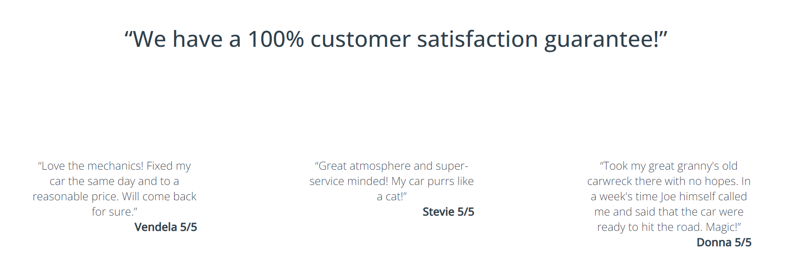

# Welcome to Joe's Garage

Joe's Garage is a basic business website for a local garage. They provide basic car service like oil change, brakes service and wheel alignment. They also sell DIY kits to allow customers to either do service in their own garage or to rent a car lift at Joe's to do the job side by side with experienced mechanics.

The intended audience is anyone with a car, but of course the theme can easily be changed.

Live site can be visited at: [Joe's Garage website](https://sherkaerka.github.io/Joes-Garage "Joe's Garage")
 
 

 
 

# Table of contents
* [User Experience](#user-experience-a-nameuser-experiencea)
    * [User Stories](#user-stories-a-nameuserstoriesa)
    * [Wireframes](#wireframes-a-namewireframesa)
    * [Site Structures](#site-structures-a-namesitestructuresa)
    * [Design Choices](#design-choices-a-namedesignchoicesa)
        * [Typography](#typography-a-nametypographya)
        * [Color Scheme](#color-scheme-a-namecolorschemea)
* [Features](#features-a-namefeaturesa)
    * [Home](#home-a-namehomea)
        * [Navigation Menu](#navigation-menu-a-namenavigationmenua)
        * [24 Hour Service](#24-hour-service-number-a-name24ha)
        * [Quotes](#quotes-a-namequotesa)
        * [About](#about-a-nameabouta)
        * [Services](#services-a-nameservicesa)
        * [Testimonials](#testimonials-a-nametestimonialsa)
        * [Footer](#footer-a-namefootera) 
    * [Joe's DIY](#joes-diy-a-namejoesdiya)
        * [Buy our DIY kits](#buy-our-diy-kits-a-namebuydiya)
        * [Instruction Videos](#instruction-videos-a-nameinstructionvideosa)
    * [Contact](#contact-a-namecontacta)
        * [Contact Details](#contact-details-a-namecontactdetailsa)
        * [Map](#map-a-namemapa)
        * [Contact Form](#contact-form-a-namecontactforma)
    * [Form Confirmation](#form-confirmation-a-nameformconfirmationa)
    * [Future Features](#future-features-a-namefuturefeaturesa)
* [Technologies Used](#technologies-used-a-nametechuseda)
* [Testing](#testing-a-nametestinga)

## User Experience 

### User Stories 
* As a As a user I want to be able to navigate through the whole site smoothly, no matter device.
* As a user I quickly want to understand the purpose of the site upon loading it.
* As a user I want to see what services are being offered and to what cost.
* As a user I want to easily be able to contact Joe's Garage for more information or help with my car.
* As a user I want to be inspired and to challenge myself to maybe one day fix my own car.
* As a user I want to know some history and basic facts about Joe's Garage.
* As a user I want to know how other peoples' experiences with Joe's Garage has been.
* As a user I want to connect with Joe's Garage on social media and become a part of their community.

[Back to top](#table-of-contents)

### Wireframes 
Wireframes to Joe's Garage were created in [Balsamiq](https://balsamiq.com/) and shows general ideas in fullscreen and smartphone set-up. As seen below the basic idea is to stack and decrease padding when device become smaller.

[Back to top](#table-of-contents)

### Site Structures 
Joe's Garage site has three main pages: **home**, **Joe's DIY** and **Contact**. There is also a hidden fourth page that will show a Thanks you for contacting us, when contact form has been submitted. The footer also contains links to map, contact form and Joe's DIY.

[Back to top](#table-of-contents)

### Design Choices 
I wanted to create a fresh and clean site but with some classic garage feeling.

#### Typography 

Body and headers uses different font weight and spacing of Open Sans with a fallback to sans-serif. The logo to Joe's garage that s displayed in both the header and footer is Yellowtail.

#### Color scheme 

[Back to top](#table-of-contents)

## Features 
Joe's Garage is set up as a basic business website with some more modern touch covering the most important functions to interact with visitors.

### Home 
The home page starts out with a little bit different layout with a larger hero image in the background. This image changes on smaller screens to render more nicely as seen on the [responsive image](#welcome-to-joes-garage) further up.

#### Navigation menu 
Navigation menu shown on every page. On large and medium screens it appears top right and om smaller screens it is moved below Joe's Garage logo. On smaller screen we also add some background color to make sure the contrast is good still with the new hero image.

The menu has hover coloring and an underscore on the actual page being visited.

 
[Back to top](#table-of-contents)

#### 24 hour service number 
Since we are presenting a garage cars do not only need service, but sometimes they break down. Therefor Joe's 24 hour service number get some extra display on the home-page. Visually it acts like the menu thus getting a background color for contrast on smaller screens. It also has some extra glow added to it to stand out, abit like a tube light.

[Back to top](#table-of-contents)

#### Quotes 
Quotes are a recurring section on all pages. It's there to give a more personal feel and touch to the website.

[Back to top](#table-of-contents)

#### About 
The About section is a combined welcome to us, give some short history to build confidence and a wish to see more of Joe's. This is also where the "block-design" is introduced with a 50% width each. Title on one side and content on the other.

[Back to top](#table-of-contents)

#### Services 
So this is where the classic services are being presented. This is when you book an appointment leave your car and pick it up when it's ready. It give some short info about the job and at what price-range it starts. And just like the about-section it uses the box 50-50 style.

[Back to top](#table-of-contents)

#### Testimonials 
Testimonials are being used to show that customer satisfaction is top priority, demonstrate transparence, build confidence etc.
This is aslo done together with a quote or a statement.

[Back to top](#table-of-contents)

#### Footer 
Appears in the exact same way on all pages. Shows logotype, som useful internal links and social buttons. Also a copyright line is at the very bottom.

[Back to top](#table-of-contents)

### Joe's DIY 
The DIY is a new concept that as acontrast to us being more and more isolated with less human interaction instead invites and encourages the customer to buy all necessary service parts and do the job themselves, next to experienced mechanics.

[Back to top](#table-of-contents)

#### Buy our DIY kits 
The kits being presented with the same 50-50 boxes. And just like with the classic services a pricerange is given.

[Back to top](#table-of-contents)

#### Instruction videos 
As part of the DIY-concept these can work like instructions on how to carry out the service. See it as some pre-studies and yet another way to connect with potential customers. These are iframes so that they will work and be controlled on the website.

[Back to top](#table-of-contents)

### Contact 
Classic contact page with contact details, map and a contact form. Starting with a quote or a promise that we always get back to the customer within one working day. 

[Back to top](#table-of-contents)

#### Contact Details 
Contact Details is being presented with the same 50-50 boxes along with the map.

[Back to top](#table-of-contents)

#### Map 
Map presented being a iframe with google maps. Picture as above.

[Back to top](#table-of-contents)

#### Contact form 
A clean and nice contact form. State who you are how we can get back to you, a dropdown to categorize the message and a freetext area. The send button has the same button design that goes for the whole site.

 
[Back to top](#table-of-contents)

### Form Confirmation 
A hidden landing page that gives the customer feedback that the message has been received and what will happen next. This page still has the same header and footer so that the user easily can navigate back.

[Back to top](#table-of-contents)

### Future Features 
Some possible improvements but not limited to:

* Chatbot
* Webshop for DIY-kits and merch
* Online booking system
* Integrate with some customer rating system
* Attach images to contact form

[Back to top](#table-of-contents)

## Technologies Used 

HTML5 - provides the content and structure for the website.
CSS3 - provides the styling.
Balsamiq - used to create the wireframes.
Gitpod - used to deploy the website.
Github - used to host and edit the website.

[Back to top](#table-of-contents)

## Testing 

Please refer to[testing protocol]() for more information on testing Joe's Garage.

[Back to top](#table-of-contents)

## Deployment

## Credits

### Content

### Media

## Acknowledgements

Joe's Garage was developed as Milestone Project no1 for [Code Institute](https://codeinstitute.net "Code Institute").