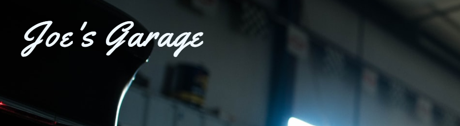

# Welcome to Joe's Garage

Joe's Garage is a basic business website for a local garage. They provide basic car service like oil change, brakes service and wheel alignment. They also sell DIY kits to allow customers to either do service in their own garage or to rent a car lift at Joe's to do the job side by side with experienced mechanics.

The intended audience is anyone with a car, but of course the theme can easily be changed.

Live site can be visited at: [Joe's Garage website](https://sherkaerka.github.io/Joes-Garage "Joe's Garage")
 
 

 
 

# Table of contents
* [User Experience](#ux)
    * [User Stories](#userstories)
    * [Wireframes](#wireframes)
2. [Some paragraph](#paragraph1)
    1. [Sub paragraph](#subparagraph1)
3. [Another paragraph](#paragraph2)

## User Experience 

### User Stories 
* As a As a user I want to be able to navigate through the whole site smoothly, no matter device.
* As a user I quickly want to understand the purpose of the site upon loading it.
* As a user I want to see what services are being offered and to what cost.
* As a user I want to easily be able to contact Joe's Garage for more information or help with my car.
* As a user I want to be inspired and to challenge myself to maybe one day fix my own car.
* As a user I want to know some history and basic facts about Joe's Garage.
* As a user I want to know how other peoples' experiences with Joe's Garage has been.
* As a user I want to connect with Joe's Garage on social media and become a part of their community.

[Back to top](#table-of-contents)

### Wireframes 
Wireframes to Joe's Garage were created in [Balsamiq](https://balsamiq.com/) and shows general ideas in fullscreen and smartphone set-up. As seen below the basic idea is to stack and decrease padding when device become smaller.

## Some paragraph 
The first paragraph text

### Sub paragraph 
This is a sub paragraph, formatted in heading 3 style

## Another paragraph 
The second paragraph text

## Languages

Joe's Garage is created with *HTML5* and *CSS3*.
 
 

## Release History

Joe's Garage was developed as Milestone Project no1 for [Code Institute](https://codeinstitute.net "Code Institute").

*2022-07-04* Initial Commit

 
 

## Future development

Some possible improvements but not limited to:

* Chatbot
* Webshop for DIY-kits and merch
* Online booking system
 
 

## Credits

Hero Image photographer Logan Meis, via [Unsplash](Unsplash.com "Unsplash"). 

Youtube instruction-videos has nothing to do with Joe's Garage but are exemples of how videos could be embedded on the site.

 
------
 

## MIT License

Copyright <2022> <Erik Lindén>

Permission is hereby granted, free of charge, to any person obtaining a copy of this software and associated documentation files (the "Software"), to deal in the Software without restriction, including without limitation the rights to use, copy, modify, merge, publish, distribute, sublicense, and/or sell copies of the Software, and to permit persons to whom the Software is furnished to do so, subject to the following conditions:

The above copyright notice and this permission notice shall be included in all copies or substantial portions of the Software.

THE SOFTWARE IS PROVIDED "AS IS", WITHOUT WARRANTY OF ANY KIND, EXPRESS OR IMPLIED, INCLUDING BUT NOT LIMITED TO THE WARRANTIES OF MERCHANTABILITY, FITNESS FOR A PARTICULAR PURPOSE AND NONINFRINGEMENT. IN NO EVENT SHALL THE AUTHORS OR COPYRIGHT HOLDERS BE LIABLE FOR ANY CLAIM, DAMAGES OR OTHER LIABILITY, WHETHER IN AN ACTION OF CONTRACT, TORT OR OTHERWISE, ARISING FROM, OUT OF OR IN CONNECTION WITH THE SOFTWARE OR THE USE OR OTHER DEALINGS IN THE SOFTWARE.

 
------
 
With love,
Erik Lindén